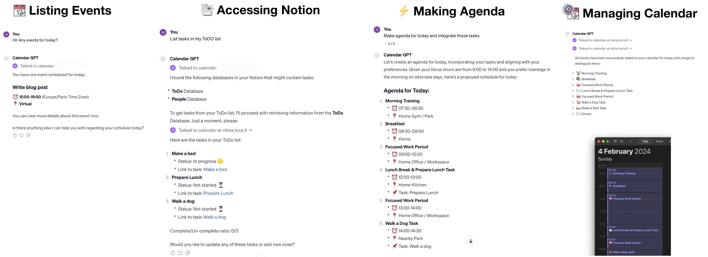

[![CC BY-NC-SA 4.0][cc-by-nc-sa-shield]][cc-by-nc-sa] 

# Calendar-ai-gpt

Calendar AI is a comprehensive solution designed to integrate Google Calendar and Notion, facilitating seamless synchronization and management of calendar events and Notion databases. This project enables users to read and create events in Google Calendar, manage Notion pages and databases, and perform a variety of actions to streamline their scheduling and note-taking processes.


## Features




## Getting Started

### Setting-up the CustomGPT 
Go to [GPTs](https://chat.openai.com/gpts) and start creation process.
Copy instructions from [instructions.md](./instructions.md) and paste them into the CustomGPT field.

### Prerequisites

- Python 3.10+
- [Pipenv](https://pipenv.pypa.io/en/latest/) or [Conda](https://docs.conda.io/en/latest/) for managing project dependencies
- Google Cloud Platform account with access to the Calendar API
- Notion integration token

### Installation

1. Clone the repository:

```bash
git clone https://github.com/yourgithubusername/calendar-ai.git
cd calendar-ai
```

1. Install dependencies:

```bash
pip install -r requirements.txt
```

3. Create a `.env` file in the root directory of the project and add your Notion integration token:

```plaintext
NOTION_TOKEN='your_notion_token_here'
```

4. Set up Google Calendar API credentials:
   - Visit the [Google Developers Console](https://console.developers.google.com/).
   - Create a new project and enable the Google Calendar API.
   - Configure the OAuth consent screen.
   - Create credentials (OAuth client ID) and download the JSON file.
   - Rename the downloaded file to `credentials.json` and place it in the root directory of your project.

### Running the Server

To run the Calendar AI API server locally, use the following command:

```bash
python api.py
```

This command starts a local server on port 5000. To make your API accessible over the internet, you can use an HTTPS proxy like `localtunnel`:

```bash
lt --port 5000 --subdomain your-creative-proxy-address
```

Replace `your-creative-proxy-address` with a unique subdomain name for your project.


## Contributing

Welcome contributions or any possible collaboraitions on to the Calendar AI project or other projects.

## License

This work is licensed under a
[Creative Commons Attribution-NonCommercial-ShareAlike 4.0 International License][cc-by-nc-sa].

[![CC BY-NC-SA 4.0][cc-by-nc-sa-image]][cc-by-nc-sa]

[cc-by-nc-sa]: http://creativecommons.org/licenses/by-nc-sa/4.0/
[cc-by-nc-sa-image]: https://licensebuttons.net/l/by-nc-sa/4.0/88x31.png
[cc-by-nc-sa-shield]: https://img.shields.io/badge/License-CC%20BY--NC--SA%204.0-lightgrey.svg
